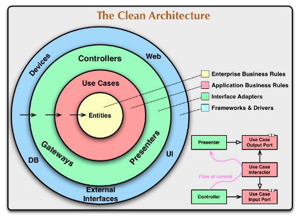
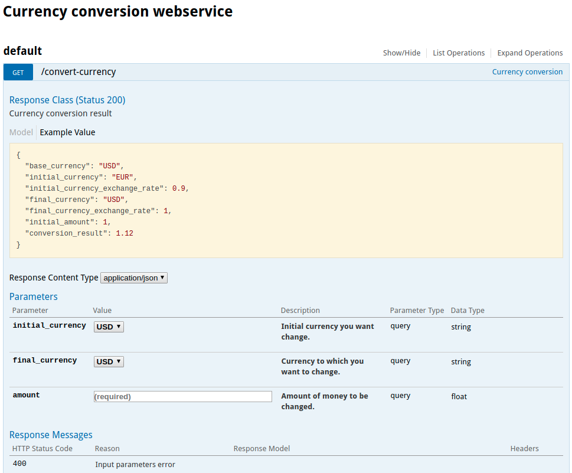
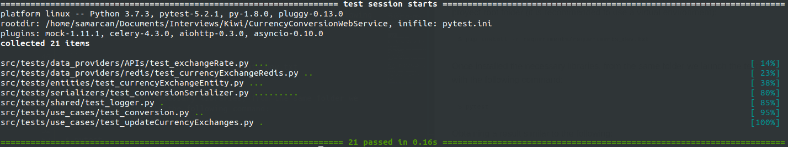

# Currency-Conversion-Webservice

This project consists of the development of a webservice that provides an endpoint for the conversion between different currencies. Exchange rates are scheduled to be updated daily by obtaining information from: [openexchangerates.org](https://openexchangerates.org/).


## Technical specifications

La versión de python usada en este proyecto es `Python 3.7`.

The webservice is developed with the framework `aiohttp`.  To handle asynchronous tasks `celery` has been used as python framework and `Redis` as message broker.  To store the data of the exchanges rates obtained daily, `Redis` has been used, storing in disk a backup each time this data is updated.

In this project the architecture that has been tried to follow has been 'The clean Architecture'.



## How to run services

In order to launch the project we must first create a `settings-variables.env` file that contains the environment variables that the webservice needs to work. This file must be located in the `root folder` of the project. The necessary variables are the following:

* `OER_APP_ID`: OpenExchangeRates App Id.
* `REDIS_HOST`: Host where the redis service is running.
* `REDIS_PORT`: Port where the redis service is running.
* `SERVER_PORT`(not required): This is the port where the webservice will run. note that if you change this variable you will have to open the webservice service port in the `docker-compose.yml` file.

An example of this file that works with the docker-compose would be the following:

```
SERVER_PORT=8080
REDIS_HOST=redis
REDIS_PORT=6379
OER_APP_ID=<OpenExchangeRates_App_Id>
```

Once we have the configuration variables we can launch the services described in the file `docker-compose.yml` launching in the terminal the following command from the root folder of the project:

```shell
$ docker-compose up
```

We will now be able to access the Swagger documentation page located at the following address:
```
http://<host>:<port>/api/doc
```

We'll find something like this:




## Examples API requests

### Example 1 - Success

**Request**
```shell
$ curl -X GET --header 'Accept: application/json' 'http://localhost:8080/convert-currency?initial_currency=USD&final_currency=EUR&amount=1'
```
**Response** - Status code 200

```json
{
    "base_currency": "USD",
    "initial_currency": "USD",
    "initial_currency_exchange_rate": 1,
    "final_currency": "EUR",
    "final_currency_exchange_rate": 0.9,
    "initial_amount": 1,
    "conversion_result": 0.9
}
```

### Example 2 - Error

**Request**
```shell
$ curl -X GET --header 'Accept: application/json' 'http://localhost:8080/convert-currency?initial_currency=USD&final_currency=EUR'
```
**Response** - Status code 400

```json
{
    "errors": {
        "amount": [
            "This field is required."
        ]
    }
}
```

## How to run tests

If we want to launch the unittests we must install the dependencies file `requeriments_dev.txt` launching in the console the following command from proyect root folder (it is recommended to use a virtual environment):

```shell
$ pip install -r requeriments/requeriments_dev.txt
```

Once installed the necessary libraries, from the same folder we launch the tests with the following command:

```shell
$ pytest
```

Obtaining a result similar to the following:


